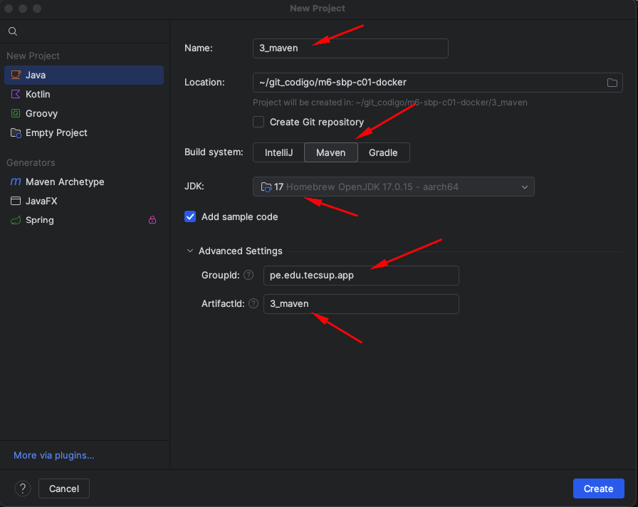

## Dockerfile con proyecto en Maven

### Crear un proyecto en Maven


### Agregar al archivo pom.xml el Manifest
```xml
    <build>
        <plugins>
            <plugin>
                <groupId>org.apache.maven.plugins</groupId>
                <artifactId>maven-jar-plugin</artifactId>
                <version>3.3.0</version>
                <configuration>
                    <archive>
                        <manifest>
                            <addClasspath>true</addClasspath>
                            <mainClass>pe.edu.tecsup.app.Main</mainClass>
                        </manifest>
                    </archive>
                </configuration>
            </plugin>
        </plugins>
    </build>
```

### Construir el componente jar
```
mvn clean package
```

### Ejecutar el componente
```
java -jar target/3_maven-1.0-SNAPSHOT.jar
```

### Crear el Dockerfile
```Dockerfile
FROM openjdk:17

WORKDIR /app

COPY target/*.jar /app/app.jar

CMD ["java", "-jar", "/app/app.jar"]
```
### Construir la imagen Docker
```
docker build -t myappjava:1.0 .
```
### Ejecutar el contenedor Docker
```
docker run -d --name myappjava01 myappjava:1.0
```
### Ver los logs del contenedor
```
docker logs myappjava01
```